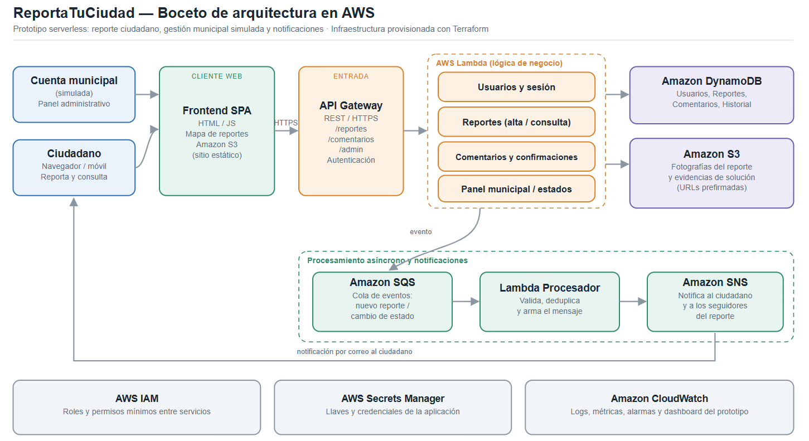

# ReportaTuCiudad

Plataforma web que conecta a los ciudadanos con una **cuenta oficial municipal simulada** para reportar, dar seguimiento y cerrar problemas urbanos: baches, luminarias dañadas, acumulación de basura, fugas de agua, árboles caídos o semáforos fuera de servicio.

Un ciudadano crea su cuenta, levanta un reporte con descripción, fotografía y ubicación, y lo ve publicado en un mapa junto con los demás reportes de su zona. Otros usuarios pueden confirmar que también observaron el problema y comentar en él, lo que evita reportes duplicados y muestra qué incidencias afectan a más personas. La cuenta municipal atiende los reportes desde un panel administrativo, cambia su estado, responde y publica la evidencia de la solución; el ciudadano recibe una notificación y confirma si el problema realmente quedó resuelto.

El objetivo no es construir un sistema gubernamental real, sino un **prototipo funcional** que simule el ciclo completo de comunicación entre ciudadanía e institución municipal sobre una arquitectura serverless en AWS.

## Estados de un reporte

`Reportado` → `En revisión` → `Asignado` → `En proceso` → `Resuelto`

## Flujos end to end

1. **Levantar un reporte ciudadano.** Registro/inicio de sesión, formulario con categoría, descripción, ubicación y foto (subida a S3 con URL prefirmada), guardado en DynamoDB y publicación en el mapa.
2. **Gestión y cambio de estado por la cuenta municipal.** Panel administrativo con filtros, cambio de estado, respuesta al ciudadano, evidencia de solución e historial del reporte.
3. **Participación comunitaria y confirmación del cierre.** Confirmaciones ("yo también lo vi"), comentarios, notificación por correo al cerrar y validación del ciudadano; si la mayoría indica que no se resolvió, el reporte se reabre.

## Arquitectura y servicios de AWS

| Servicio | Uso en el proyecto |
|---|---|
| Amazon API Gateway | Punto de entrada HTTPS de la API REST (`/reportes`, `/comentarios`, `/admin`) |
| AWS Lambda | Lógica de negocio: reportes, comentarios, confirmaciones y cambio de estados |
| Amazon DynamoDB | Usuarios, reportes, comentarios, confirmaciones e historial |
| Amazon S3 | Fotografías, evidencias de solución y hospedaje del sitio estático |
| Amazon SQS + Amazon SNS | Procesamiento asíncrono de eventos y notificaciones por correo |

Servicios de soporte: **AWS IAM** (permisos mínimos), **AWS Secrets Manager** (llaves y credenciales) y **Amazon CloudWatch** (logs, métricas, alarmas y dashboard).

Diagrama de arquitectura:



## Infraestructura como código

Toda la infraestructura se levanta con **Terraform**: tablas de DynamoDB, buckets de S3, funciones Lambda, API Gateway, cola de SQS, tópico de SNS, roles de IAM y alarmas de CloudWatch. El estado remoto se guarda en un bucket de S3 con bloqueo en DynamoDB.

```bash
cd infra
terraform init
terraform plan  -var-file=envs/dev.tfvars
terraform apply -var-file=envs/dev.tfvars
terraform destroy -var-file=envs/dev.tfvars   # al terminar de trabajar
```

> No se versionan archivos `.tfstate`, `.tfvars` con datos sensibles ni credenciales de AWS.

## Estructura del repositorio

```
/frontend   Interfaz del ciudadano y panel municipal
/backend    Funciones Lambda y definición de la API
/infra      Módulos de Terraform (IaC) y variables por ambiente
/docs       Diagrama de arquitectura y documentación de fases
```

## Equipo

| Integrante | Rol |
|---|---|
| Carlos Olmedo  | Líder de proyecto, arquitectura cloud, Terraform y monitoreo (IAM, Secrets Manager, SQS, SNS, CloudWatch) |
| Luis Hernandez | Backend, API y datos (Lambda, API Gateway, DynamoDB, S3) |
| Isaian Ayala   | Frontend, pruebas y documentación (interfaz ciudadana, panel municipal, repositorio) |

## Estado del proyecto

Fase 1 — Planteamiento del proyecto (entrega: 28 de septiembre de 2026).
